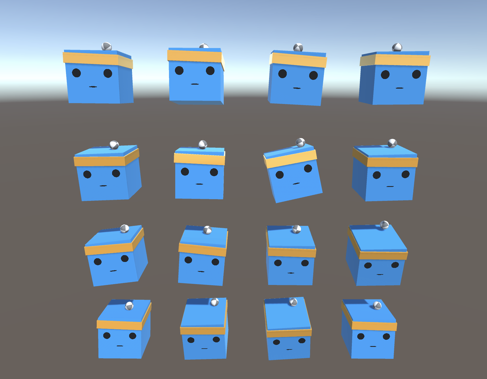

# Unity ML-Agents 3D Ball Demo



## Environments

* [ml-agents branch `release_18`](https://github.com/Unity-Technologies/ml-agents/releases/tag/release_18)
  * Installed `com.unity.ml-agents` via Package Manager
    with git url `git+https://github.com/Unity-Technologies/ml-agents.git?path=com.unity.ml-agents#release_18`
* Python environment (`requirements.txt`)
  * `mlagents==0.27.0`

## Unity Project

See [./3DBalanceBall/README.md](./3DBalanceBall/README.md)

## How to train model

```sh
mlagents-learn ./mlagents-learn-configs/3DBall.yaml
```
